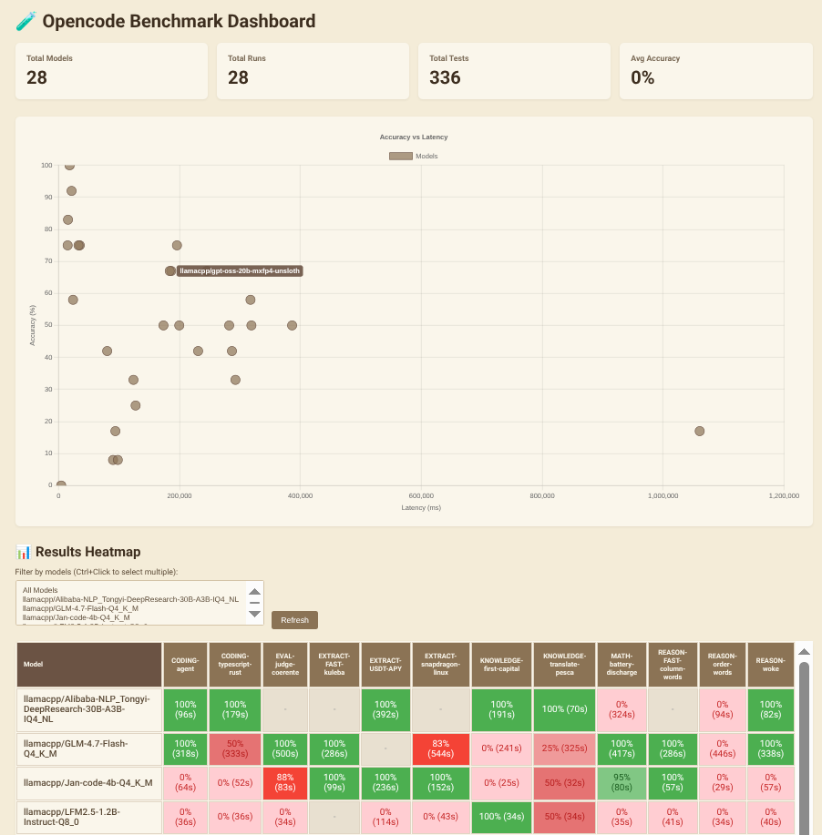

# opencode-benchmark-dashboard

Benchmark system for testing opencode with various LLM models, measuring speed (latency) and correctness (accuracy).



## Why ?
- The best tradeoff depends on your use-case and your hardware
- accuracy vs speed: reasoning, tok/s, different quantizations matters. Some small LLM can fix themself using tools, a fast LLM can be slow because it wastes too many tokens in the reasoning. Just test them in real world scenarios.


## Quick Start

```bash
# Install dependencies
bun install

# Fill prompts/ and prompt-answers/ with your test cases ex. CODING-my-single-test.txt
# Check `~/.config/opencode/opencode.json` with your OpenAI-compatible models.

# It generates the answers with a specific model. use `opencode models` to see the availables
bun run answer -m "opencode/minimax-m2.5-free"
# bun run answer -m "opencode/minimax-m2.5-free" -t CODING-my-single-test

# It generates the evaluations with a specific model.
bun run evaluate -m "opencode/minimax-m2.5-free"
# bun run evaluate -m "opencode/minimax-m2.5-free" -t CODING-my-single-test

# it opens the dashboard on http://localhost:3000
bun run dashboard
```

## Requirements

- [Bun](https://bun.sh/) runtime
- [opencode](https://opencode.ai) CLI installed and in PATH
- Models pre-configured in `~/.config/opencode/opencode.json`

